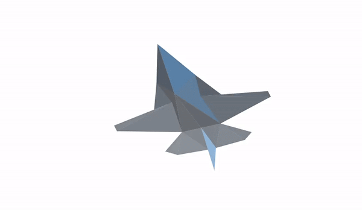

notes: https://docs.google.com/document/d/1O4p7wp5PDOXYR603c-Hvf3A5mCqCEAJT4kB97HY5n2I/edit?usp=sharing
 Game: 

 
 Example of a model, you can see that depth buffer hasn't been implemented because it currently uses html canvas for rendering triangles.
 
